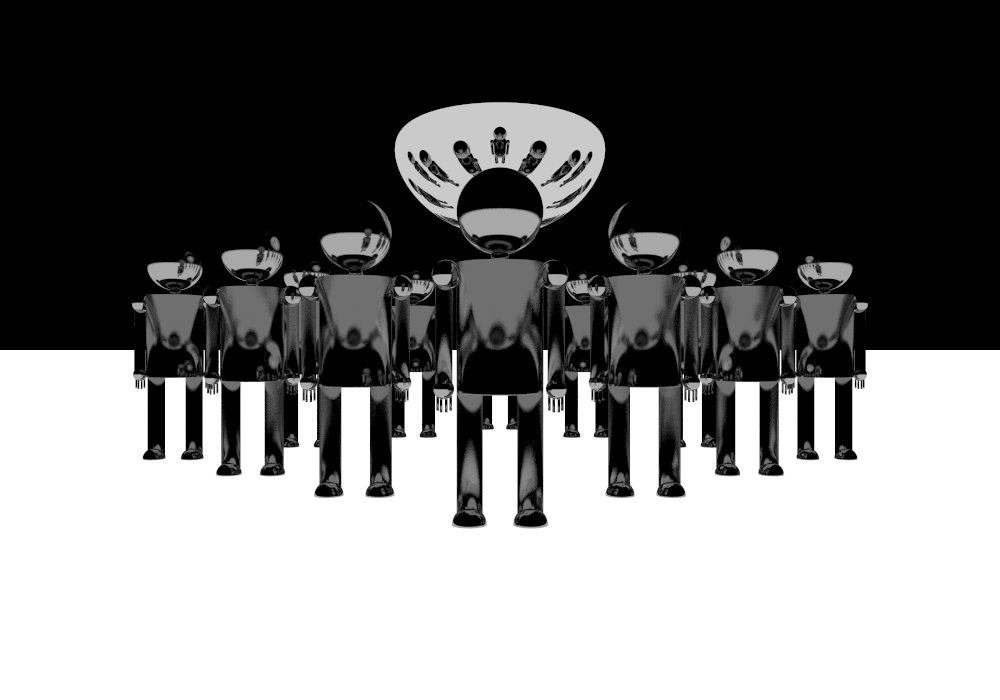
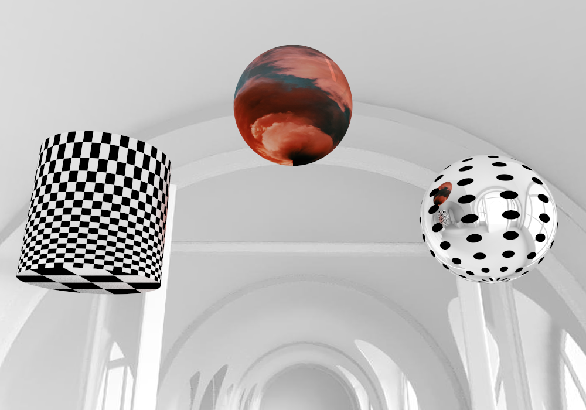

# Fundamentals of Computer Graphics (Computergrafik Grundlagen) at Berliner Hochschule für Technik (BHT)
## Media computer science/Medieninformatik B.Sc.

I attended the "Fundamentals of Computer Graphics" course with Prof. Dr. Henrik Tramberend, in the summer semester of 2022. 
Throughout the course, we were challenged with multiple Java programming exercises that covered the fundamentals of computer graphics and ray tracing. We started the semester with simple image creation, with iteration through every pixel creating a simple circle, to rendering 3D objects with different textures and materials in high definition.

Course topics:
- trigonometry, vectors, points, surfaces
- coordinate systems and transformations
- color and light
- sampling and aliasing
- modeling and geometry
- rendering and ray-tracing
- lighting, shading and reflection
- material and texture

Below are some examples of images that I created with my ray tracer (the full set of images that I created can be found in the doc folder, with the corresponding code in src).

In the img folder I have used two images from the internet to create the scene:
- Pixexid. "A close up of a buildung" Pixexid. 23.06.2022, https://pixexid.com/image/2g36eai-a-close-up-of-a-building.
- Unsplash. "Orange smoke on blue background photo" Unsplash. 23.06.2022, https://unsplash.com/photos/Hyu76loQLdk.
